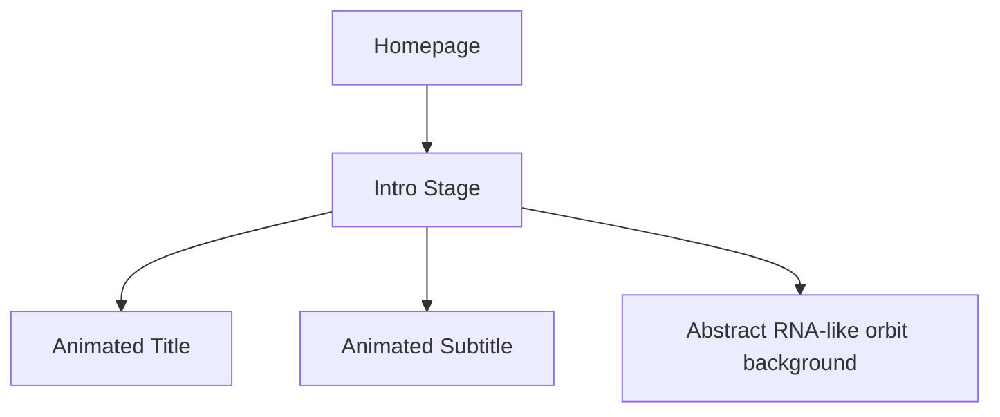
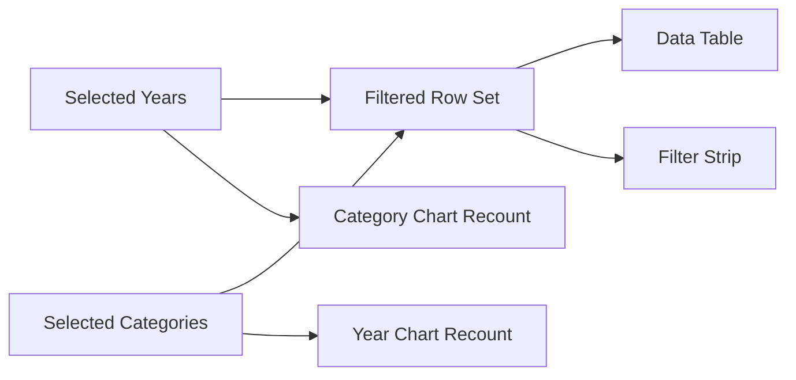

# RNA Mapping Database Homepage Redesign Notes

Date: 2026-04-23  
Project: `/Users/hulinyan/Desktop/rna-mapping-db`

## 1. Weekly Focus

This week the homepage was redesigned around three goals:

1. Unify the visual language of the homepage.
2. Make the statistics panel feel lighter, cleaner, and more interactive.
3. Connect homepage filtering, data table updates, and structure display into one workflow.

---

## 2. Main Changes

### 2.1 Homepage visual system

The homepage was moved away from a flat white dashboard style and rebuilt into a soft green, science-oriented interface.

Key updates:

- Removed the large green top banner image.
- Replaced the page background with a green gradient atmosphere.
- Unified typography so the whole site uses the same font family.
- Centered the navigation and softened the navbar container.
- Added a homepage intro stage with animated title text.

Relevant files:

- [src/styles.css](/Users/hulinyan/Desktop/rna-mapping-db/src/styles.css)
- [src/main.js](/Users/hulinyan/Desktop/rna-mapping-db/src/main.js)

Code excerpt:

```css
body {
  background:
    radial-gradient(circle at 12% 8%, rgba(199, 227, 107, 0.34), transparent 24%),
    radial-gradient(circle at 88% 10%, rgba(47, 143, 107, 0.2), transparent 20%),
    radial-gradient(circle at 50% 0%, rgba(23, 75, 58, 0.14), transparent 32%),
    linear-gradient(180deg, #dcebdd 0%, #edf5ee 18%, #f4f7f2 40%, #eef5ef 100%);
}
```

---

### 2.2 Intro section redesign

The homepage intro was rebuilt into a centered animated hero section.

Current content:

- Title: `Welcome to RNA Mapping Database`
- Subtitle: `— XXX placeholder text for a future one-sentence database introduction`

The text now appears letter by letter rather than as a static block.

Code excerpt:

```js
const heroTitle = 'Welcome to RNA Mapping Database';
const heroSubtitle = '— XXX placeholder text for a future one-sentence database introduction';

const renderAnimatedText = (text, baseDelay = 0) =>
  Array.from(text)
    .map((char, index) => {
      const display = char === ' ' ? '&nbsp;' : char;
      return `<span class="intro-letter" style="--char-index:${baseDelay + index};">${display}</span>`;
    })
    .join('');
```

Layout logic:



---

### 2.3 Data overview section redesign

The statistics area was reworked visually and functionally.

Visual changes:

- Softer pastel palette replaced stronger saturated colors.
- Bar chart height and weight were reduced.
- Donut chart was rebuilt as clickable SVG segments.
- Filter strip appears only when filters are active.

Files involved:

- [src/main.js](/Users/hulinyan/Desktop/rna-mapping-db/src/main.js)
- [src/styles.css](/Users/hulinyan/Desktop/rna-mapping-db/src/styles.css)

Pastel color palettes:

```js
const donutPalette = ['#8FC8BE', '#E8BF8B', '#B9C8EC', '#DDBEE9', '#BFD8A5', '#E7B4AA', '#C7B9E8'];
const barPalette = ['#E9A693', '#B8D9EE', '#C7E8D2', '#E8D6B0', '#D0BCEB', '#B9E2DB', '#EAB8CF', '#CFE3AE', '#B8C8EF', '#E6C39A', '#B9E7EA', '#DDB8B8'];
```

Bar chart sizing was reduced:

```css
.dashboard-year-chart {
  min-height: 220px;
}

.dashboard-year-plot {
  height: 190px;
}

.dashboard-year-bar-track {
  width: 18px;
  max-width: 18px;
}
```

---

### 2.4 Cross-filtering between bar chart and donut chart

This was one of the most important functional upgrades.

Behavior now:

- Clicking a year filters the table.
- Clicking a category filters the table.
- Year selections and category selections support multi-select.
- The year chart updates when categories are selected.
- The category chart updates when years are selected.
- Filter tags can be removed individually.
- A `Reset All` button clears all filters.
- An `Export Data` button exports the currently filtered rows.

Cross-filter logic:



Key logic excerpts:

```js
function getFilteredHomeDashboardRows(rows) {
  return rows.filter((row) => {
    const matchesYear = homeDashboardFilters.years.length
      ? homeDashboardFilters.years.includes(String(row.article ?? ''))
      : true;
    const matchesCategory = homeDashboardFilters.categories.length
      ? homeDashboardFilters.categories.includes(String(row.category ?? ''))
      : true;
    return matchesYear && matchesCategory;
  });
}
```

```js
function filterRowsByDashboardFilters(rows, filters = homeDashboardFilters) {
  return rows.filter((row) => {
    const matchesYear = filters.years?.length ? filters.years.includes(String(row.article ?? '')) : true;
    const matchesCategory = filters.categories?.length ? filters.categories.includes(String(row.category ?? '')) : true;
    return matchesYear && matchesCategory;
  });
}
```

```js
const rowsForYearChart = filterRowsByDashboardFilters(dashboard.rows, {
  years: [],
  categories: homeDashboardFilters.categories
});

const rowsForCategoryChart = filterRowsByDashboardFilters(dashboard.rows, {
  years: homeDashboardFilters.years,
  categories: []
});
```

Event binding:

```js
function initHomeDashboardFilters() {
  const filterButtons = document.querySelectorAll('[data-home-filter-kind]');
  if (!filterButtons.length) return;

  filterButtons.forEach((button) => {
    button.addEventListener('click', () => {
      const kind = button.getAttribute('data-home-filter-kind');
      const value = button.getAttribute('data-home-filter-value');
      if (!kind || !value) return;
      const key = kind === 'year' ? 'years' : 'categories';
      const values = new Set(homeDashboardFilters[key]);
      if (values.has(value)) values.delete(value);
      else values.add(value);
      homeDashboardFilters[key] = [...values];
      render({ preserveScroll: true });
    });
  });
}
```

---

### 2.5 Donut chart rebuilt as SVG

The category chart is no longer just a static styled ring. It is now rendered as SVG segments so that the chart itself can be clicked.

Relevant code:

```js
function createDonutSegments(entries, palette) {
  const total = entries.reduce((sum, [, count]) => sum + count, 0);
  if (!total) return [];
  let startAngle = 0;
  return entries.map(([label, count], index) => {
    const angle = (count / total) * 360;
    const endAngle = startAngle + angle;
    const segment = {
      label,
      count,
      color: palette[index % palette.length],
      startAngle,
      endAngle
    };
    startAngle = endAngle;
    return segment;
  });
}
```

```js
<svg class="dashboard-donut" viewBox="0 0 180 180" aria-label="Category distribution chart">
  ...
</svg>
```

This also required a special case for `100% single-category` display, because a complete circle needs different SVG handling than partial arcs.

---

### 2.6 Structure gallery: secondary + tertiary split layout

The homepage structure section was upgraded from a single 3D viewer into a split layout:

- Left: secondary structure area
- Right: tertiary structure viewer

Current status:

- The left panel keeps the planned Forna-style frame.
- The inside is intentionally blank for now.
- If no secondary structure is available, the layout can collapse to single-column mode.
- The right panel loads Mol* and switches between available structures.

Files involved:

- [src/main.js](/Users/hulinyan/Desktop/rna-mapping-db/src/main.js)
- [src/modules.js](/Users/hulinyan/Desktop/rna-mapping-db/src/modules.js)
- [src/styles.css](/Users/hulinyan/Desktop/rna-mapping-db/src/styles.css)

Split layout:

```css
.dashboard-structure-split {
  display: grid;
  grid-template-columns: 1fr 1fr;
  gap: 18px;
  align-items: stretch;
}
```

Structure switching logic:

```js
export async function initHomeStructureShowcase() {
  const container = document.getElementById('home-structure-viewer');
  const secondary = document.getElementById('home-secondary-viewer');
  const chips = Array.from(document.querySelectorAll('.dashboard-structure-chip'));
  ...
}
```

---

### 2.7 Mol* viewer background issue

During this week, a specific issue appeared in the homepage 3D viewer:

- The first structure loaded with a white background.
- After switching to another structure, the viewer background returned to black.

Cause:

- The first `viewer.render(...)` call included `bgColor`.
- The later `viewer.visual.update(...)` call did not include the background color option.

Fix:

```js
viewer.visual.update(
  {
    customData: { url, format: 'cif' },
    bgColor: { r: 255, g: 255, b: 255 }
  },
  true
);
```

This ensured the background setting is preserved when switching structures.

---

## 3. File Summary

### Main files modified this week

- [src/main.js](/Users/hulinyan/Desktop/rna-mapping-db/src/main.js)
- [src/modules.js](/Users/hulinyan/Desktop/rna-mapping-db/src/modules.js)
- [src/styles.css](/Users/hulinyan/Desktop/rna-mapping-db/src/styles.css)

### What each file mainly changed

- `src/main.js`
  Homepage layout, animated intro, data overview rendering, chart data calculation, cross-filtering, export/reset controls.

- `src/modules.js`
  Homepage structure gallery logic, Mol* switching behavior, secondary/tertiary split handling.

- `src/styles.css`
  Visual language unification, homepage gradient, navbar polish, chart styling, filter strip styling, split viewer layout.

---

## 4. Screenshots To Add

The following screenshots are recommended for the final version of this note:

1. Homepage hero after redesign
2. Statistics area before and after palette cleanup
3. Year selection + filter strip example
4. Category selection + cross-filter example
5. Structure gallery split layout

Suggested insertion points:

- After section 2.1: overall homepage screenshot
- After section 2.4: filtered statistics screenshot
- After section 2.6: structure gallery screenshot

---

## 5. Remaining Work

The homepage is now in a usable intermediate state, but these parts can still be improved later:

- Replace the placeholder subtitle with a finalized database description.
- Replace the blank secondary structure panel with actual Forna content.
- Further refine the statistics color balance and chart spacing.
- Continue polishing whitespace between the data overview block, table, and structure gallery.

---

## 6. Short Weekly Summary

This week the homepage moved from a rough demo-style interface toward a more intentional scientific database front page.  
The major progress was not only visual cleanup, but also interaction design: the statistics panel, filter strip, data table, and structure gallery now behave more like parts of the same workflow rather than isolated blocks.
